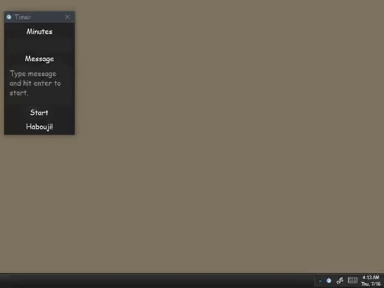
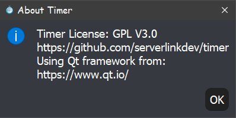
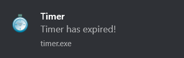
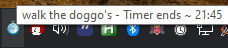

# Timer




 





A simple timer application written in C++/Qt for the GNU/Linux and MS Windows Operating System, licensed under the GPL V 3.0.  The current released version is 2.0.4

Now with Slackware Linux support! Hail Bob!

## Features:
+ Respects your Freedom a.k.a. GPL V 3.0 licensed - True "open source" software with *NO* hidden gotchas!

+ Respects your privacy - There is *NO* telemetry data collected, reported in any way.

+ No expiration dates

+ Rapid entry!  

  Just open timer:
	1. Type a number for minutes
	2. Press enter to advance to message field
	3. Type your message (optional)
	4. Press enter to start the timer (or click the start button - optional)
	
+ Full system tray support for GNU/Linux and MS Windows supporting:
  - Minimize to the system tray on startup with a nice notification.
  - Intuitive hover effects: "Start" button becomes "Stop" button when timer is activated and vice versa.
  - Always a click away: Minimize minimizes to tray when main window closed.
  - Single click minimizes AND restores from tray.
  - Cancel alarm from tray.
  - Quit program from tray.
  - Tooltip on tray icon to easily identify a timer from multiple instances.
  - Tray icon changes color to green when running, and red when timer has expired.
  - Ability to pick your own sound files from a sound file picker wizard in the tray menu.
  - Theming support: pick one of numerous dark themes (or none).
 
+ System notifications that shows your custom message and allow you to cancel the alarm from the notification.

## Installation:

### Windows:
1. Install the official Microsoft Redistributable C++ for Windows 64 bit 2015,2017 and 2019 from (https://support.microsoft.com/en-us/help/2977003/the-latest-supported-visual-c-downloads).  Here is a direct link to their exe: [vc_redist.x64.exe](https://aka.ms/vs/16/release/vc_redist.x64.exe)
2. If you intend to play a sound file other than a .wav file you will need to install DirectX codecs for your media type.  A viable option is [LAVFilters](https://github.com/Nevcairiel/LAVFilters/releases)
3. Download the timer zip and asc signature files from the releases folder here.
4. Place zip file anywhere you want
5. Verify signature (optional) * see how to below
6. Unzip
7. Double click the timer.exe

Don't forget you can right click the timer.exe to pin it to start menu, or taskbar, or put shortcut on your desktop.

Also, you can place a shortcut to timer.exe in your Start Menu with:

```
C:\Documents and Settings\<username>\Start Menu\Programs\Your Application
```

### Slackware Linux:
1. Please see the gnu subfolder.  Buildscripts and dependencies from Alien Bob are included for your use, targeting 14.2.  Also be sure to have a look at the src/doc/gnu/tips.txt file as well. If ever issues on --current, let me know.  Slackware will be supported as long as I hold breath!


### Other GNU/Linux:
- Ubuntu 18.04 will be supported until the end of its HWE lifecycle (~2023) is my intention.
- Other GNU/Linux flavors: if you submit buildscripts I'll gladly test and include :)


### Source Build:
1. GNU/Linux users: Easiest way is to open the pro file with QtCreator and run the build.  Be sure to set the build to 'release' so you your binary will be smaller.  This will auto build a shared library binary, so you only need the file 'timer' and put it anywhere on your system.  You'll probably be happiest if it's in your ~/bin directory.

### Bugs:
Timer is very stable. There are no known show stopper bugs at this time.  Should you find any please report to the email address shown in section below.

### Development:
Feature's are complete for the most part.  I might refactor to make the application more approachable for those that are new to Qt or want to volunteer.  I do keep an open mind, so if there is some feature that you'd like to see that would benefit others as well, you may contact me at the email address show in section below.

### Habouji ? What's that mean?:
This is a greeting in the "Nali" language from my favorite video game, Unreal Tournament.

## To verify the release signature:

Command line user can retrieve the key with:

```
    you@yourpc:~$ gpg --recv --keyserver hkp://keys.openpgp.org B608A617D6ED8A550BB3040582DDE559E5877342 
    gpg: key 82DDE559E5877342: public key "serverlinkdev <serverlinkdev@gmail.com>" imported
    gpg: Total number processed: 1
    gpg:               imported: 1

    you@yourpc:~$ gpg --fingerprint B608A617D6ED8A550BB3040582DDE559E5877342
    pub   rsa2048 2020-04-17 [SC]
          B608 A617 D6ED 8A55 0BB3  0405 82DD E559 E587 7342
    uid           [ unknown] serverlinkdev <serverlinkdev@gmail.com>
    sub   rsa2048 2020-04-17 [E]
```

Windows users can use: [Gpg4win.org](https://gpg4win.org/index.html) .  When fetching the key be sure to specify the keyserver:``` hkp://keys.openpgp.org```